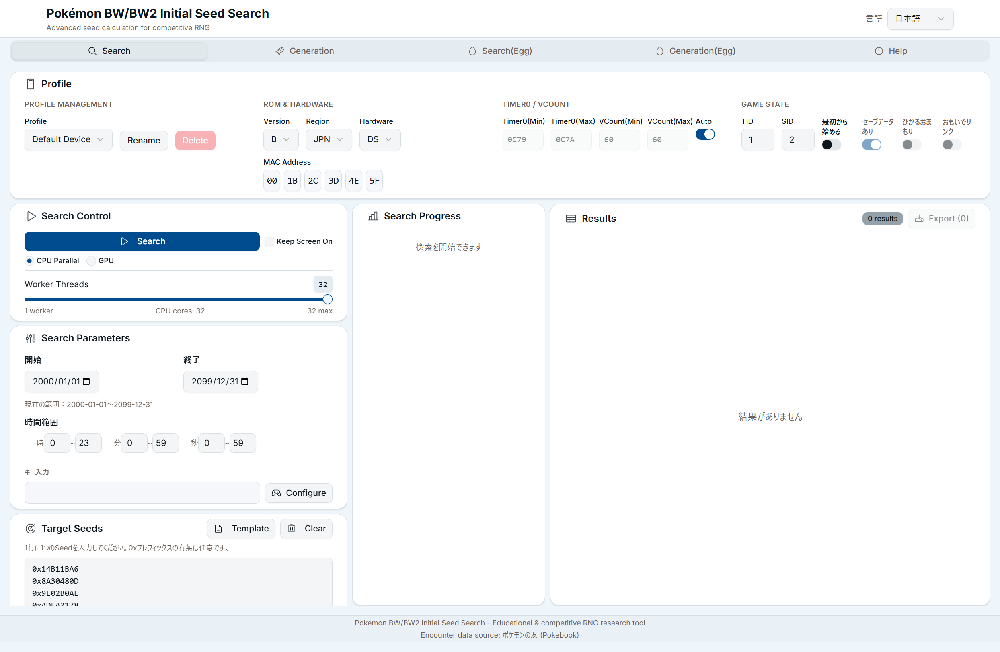
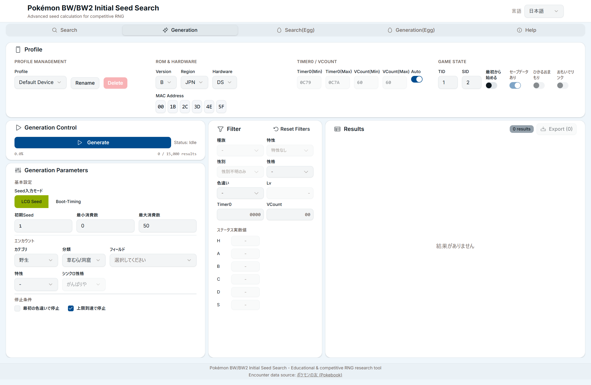
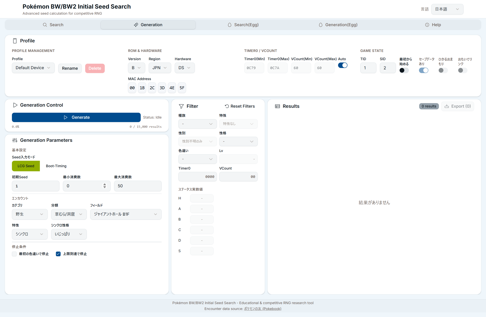

# ポケモンBW1 6Vメタモン乱数調整ガイド

本Webアプリを使用して6Vメタモンを入手する手順を解説する。

---

## 作業情報

- 作業日: 2025年12月1日
- 参照コミット: `6bd6134`
- 参照ブログ: https://milk4724.hatenablog.com/entry/20231230/00000000

---

## 目次

1. [前提条件](#1-前提条件)
2. [用語解説](#2-用語解説)
3. [準備](#3-準備)
4. [シード探索](#4-シード探索)
5. [結果の検証](#5-結果の検証)
6. [実機操作](#6-実機操作)
7. [捕獲と確認](#7-捕獲と確認)
8. [トラブルシューティング](#8-トラブルシューティング)

---

## 1. 前提条件

### 1.1 ソフト・ハード要件

| 項目 | 対応 |
|------|------|
| ゲームソフト | ポケットモンスター ブラック / ホワイト（BW1） |
| 本体 | ニンテンドーDS / DS Lite |
| パラメータ特定 | 完了済み |

**対象外**：DSi / 3DS / 2DS（本手順では対象外）

### 1.2 ゲーム進行条件

- 殿堂入り済み
- ジャイアントホール B1F に入れる状態
- C-GEAR をオフにする必要あり

### 1.3 必要なポケモン・アイテム

| 種類 | 内容 |
|------|------|
| シンクロ要員 | 任意の性格（例: いじっぱり）を持つ特性「シンクロ」のポケモン |
| あまいかおり要員 | 「あまいかおり」を覚えたポケモン |
| 捕獲要員 | HPを削る技、状態異常技を覚えたポケモン |
| ボール | クイックボール、タイマーボール、マスターボール等 |
| ペラップ（任意） | おしゃべりを録音済み（消費数調整用） |

### 1.4 ジャイアントホールの霧について

ジャイアントホールは常時霧が発生しており、通常は「あまいかおり」が使えない。
殿堂入り後、特定の手順で霧を晴らす必要がある。

詳細: https://milk4724.hatenablog.com/entry/20220928/00000000

---

## 2. 用語解説

### 初期Seed（Initial Seed）

ゲーム起動時に決定される乱数の種。起動日時・MACアドレス・キー入力・Timer0等から計算される。

### MT Seed

個体値決定に使用される32bit値。初期Seedから導出される。

### Timer0

DS本体の内部タイマー値。起動ごとに変動する可能性があり、「Timer0ズレ」の原因となる。

### VCount

映像同期カウンタ。ROM・本体の組み合わせで範囲が決まる。

### 消費数

乱数を進める回数。レポート1回 = 消費1、ペラップのステータス確認 = 消費1。

### シンクロ

先頭ポケモンの特性「シンクロ」により、野生ポケモンの性格を50%で固定できる。

---

## 3. 準備

### 3.1 パラメータ特定

本アプリを使用する前に、以下のパラメータを特定しておく必要がある:

- **MACアドレス**: DS本体の設定画面で確認可能
- **Timer0範囲**: 本体・ROM組み合わせにより固有
- **VCount範囲**: 同上

パラメータ特定が済んでいない場合は、別途特定作業を行うこと。

### 3.2 本アプリへのプロファイル登録

1. Webアプリにアクセス
2. 「Search」タブの **Profile** セクションで設定を入力:
   - **Version**: 使用ROMに合わせる（例: `B` または `W`）
   - **Region**: 日本版なら `JPN`
   - **Hardware**: 使用本体（`DS` または `DS Lite`）
   - **MAC Address**: 6セグメント（例: `00:1B:2C:3D:4E:5F`）

3. Timer0/VCount設定:
   - **Auto** がONの場合、ROM設定から自動取得される
   - 手動指定する場合は Auto をOFFにし、特定した値を入力



---

## 4. シード探索

### 4.1 検索条件の設定

「Search」タブで以下を設定:

| 項目 | 設定値 |
|------|--------|
| 開始日 | 検索開始年月日（例: `2000-01-01`） |
| 終了日 | 検索終了年月日（例: `2099-12-31`） |
| 時間範囲 | 時・分・秒の範囲を指定（狭くすると高速化） |
| キー入力 | 白い画面中に押すキーを指定 |

#### キー入力について

「Configure」ボタンをクリックし、使用するキーを選択する。
- 押しやすいキー、反応が良いキーを選ぶ
- 例: `A`, `B`, `→` など

### 4.2 Target Seeds の設定

6Vメタモン用の MT Seed（32bit）を入力する必要がある。

1. **Target Seeds** エリアに、6V個体を生成する MT Seed を1行1つずつ入力
2. 形式: `0x12345678` または `12345678`（0xプレフィックスは任意）

**6V メタモン用 MT Seed の例**:
```
0x14B11BA6
0x8A30480D
0x9E02B0AE
0xADFA2178
0xFC4AA3AC
```

これらは既存ツール（5genSearch等）で事前に算出した値を使用する。

### 4.3 検索実行

1. 「**Search**」ボタンをクリック
2. 検索が開始され、進捗が表示される
3. 検索完了後、「**Results**」に起動条件が表示される

### 4.4 検索結果の確認

結果には以下の情報が含まれる:

| 項目 | 説明 |
|------|------|
| Seed | マッチした MT Seed |
| 日時 | 起動時刻 |
| Timer0 | Timer0値 |
| VCount | VCount値 |
| キー入力 | 白い画面中に押すキー |

結果をクリックすると詳細が表示される。

---

## 5. 結果の検証

### 5.1 Generation パネルでの検証

「**Generation**」タブで、見つかった条件が6Vメタモンを生成するか確認する。



1. **Profile** セクションが Search と同じ設定になっていることを確認
2. **Generation Parameters** を設定:
   - **Seed入力モード**: `LCG Seed`（既定）または `Boot-Timing`
   - **初期Seed**: 検索結果の Seed を入力
   - **最小消費数** / **最大消費数**: 確認したい範囲（例: `0` ～ `50`）

3. **エンカウント** を設定:
   - **カテゴリ**: `野生`
   - **分類**: `草むら/洞窟`
   - **フィールド**: `ジャイアントホール B1F`
   - **特性**: `シンクロ`（シンクロ要員使用時）
   - **シンクロ性格**: 目的の性格（例: `いじっぱり`）




4. 「**Generate**」ボタンをクリック
5. **Results** に生成結果リストが表示される

### 5.2 結果フィルタリング

**Filter** セクションで結果を絞り込む:

- **種族**: メタモン
- **性格**: 目的の性格

結果リストで個体値が `31-31-31-31-31-31`（6V）になっている行を確認する。

### 5.3 消費数の特定

6V個体が出現する消費数を確認する。

- 消費数 `0`: 起動直後（レポートなし）
- 消費数 `1`: レポート1回後

---

## 6. 実機操作

### 6.1 時刻設定

1. DS本体の設定画面で日時を変更
2. 検索結果の日時より **10秒前** に設定
   - 例: 結果が `2008年10月02日 19:24:11` の場合、`2008年10月02日 19:24:00` に設定

### 6.2 ソフト起動

1. DS本体メニューでBWを選択
2. **目標時刻の1秒前**（例: `19:24:10`）にソフトを選択

### 6.3 白い画面中の操作

ソフト選択後、約5秒間白い画面が表示される。
この間に **指定されたキーを押し続ける**。

例: `A`, `B`, `→` の場合、3つのボタンを同時に長押し

### 6.4 ゲーム開始

1. ロゴ表示後、メニュー画面まで進む
2. **「続きから始める」を選択**
3. **C-GEAR がオンにならないよう**、素早くBボタン等で回避

**注意**: C-GEAR がオンになった場合、初期Seedが変わるため時刻設定からやり直す

### 6.5 乱数消費

目標の消費数だけ乱数を進める:

| 方法 | 消費数 |
|------|--------|
| レポートを書く | 1 |
| ペラップのステータスを見る | 1 |

例: 消費数1なら、レポートを1回書く

---

## 7. 捕獲と確認

### 7.1 エンカウント

1. ジャイアントホール B1F に移動
2. シンクロ要員を先頭に配置
3. 「あまいかおり」を使用してエンカウント

### 7.2 捕獲

メタモンを捕獲する。

- マスターボール使用で確実に捕獲可能
- クイックボール、タイマーボール等でも可

### 7.3 個体値確認

捕獲後、個体値を確認する方法:

1. ジャッジ機能（ゲーム内）
2. 個体値計算ツール: https://yakkun.com/dp/ic.htm

6V（全能力が31）であれば成功。

---

## 8. トラブルシューティング

### 8.1 目標個体が出ない

| 原因 | 対処 |
|------|------|
| Timer0ズレ | 複数回試行する。高頻出Timer0値を特定する |
| 時刻ズレ | 起動タイミングを再調整（1秒前選択を厳密に） |
| キー入力ミス | 白い画面中のキー押し忘れ・離しがないか確認 |
| C-GEARオン | 時刻設定からやり直し |
| 消費数ミス | レポート/ペラップ回数を確認 |

### 8.2 Timer0 の高頻出値を特定する

Timer0は起動ごとに変動するが、特定の値が出やすい傾向がある。

1. 検索結果から、異なるTimer0値の条件を複数ピックアップ
2. 各条件で実際に起動し、捕獲したポケモンの個体値を確認
3. 6V個体が出る条件のTimer0値 = 高頻出値

特定後は、その値のみで再検索すると効率的。

### 8.3 シンクロが効かない

- シンクロ要員が先頭にいるか確認
- ひんし状態でないか確認
- シンクロ成功率は50%のため、失敗時は別の起動条件を試す

### 8.4 再測定が必要な場合

本体のバッテリー残量・温度・経年劣化でTimer0値が変化することがある。
長期間使用していない場合は、Timer0範囲を再特定すること。

---

## 参照資料

### 外部リンク

- 参照ブログ（6Vメタモン乱数調整手順）: https://milk4724.hatenablog.com/entry/20231230/00000000
- 霧の晴らし方: https://milk4724.hatenablog.com/entry/20220928/00000000
- 個体値計算ツール: https://yakkun.com/dp/ic.htm

### リポジトリ内ファイル

- `src/components/layout/SearchPanel.tsx`: 検索パネル実装
- `src/components/layout/GenerationPanel.tsx`: 生成パネル実装
- `src/components/profile/ProfileCard.tsx`: プロファイル設定UI
- `src/types/search.ts`: 検索条件型定義
- `src/types/mt-seed-boot-timing-search.ts`: MT Seed検索パラメータ型定義

---

## 更新履歴

| 日付 | 内容 |
|------|------|
| 2025-12-01 | 初版作成 |
