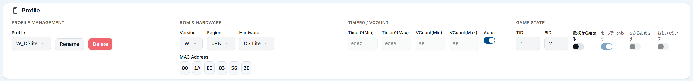
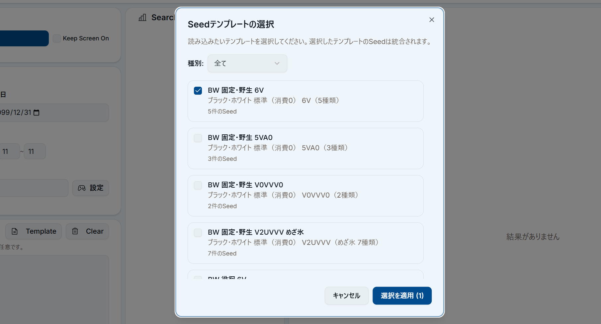
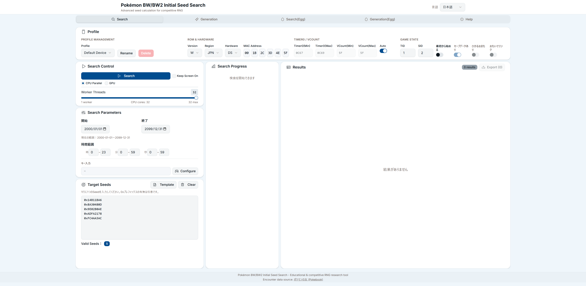
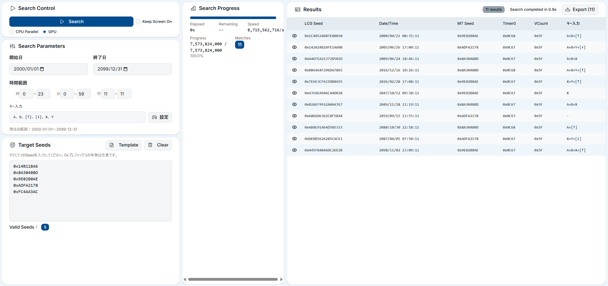
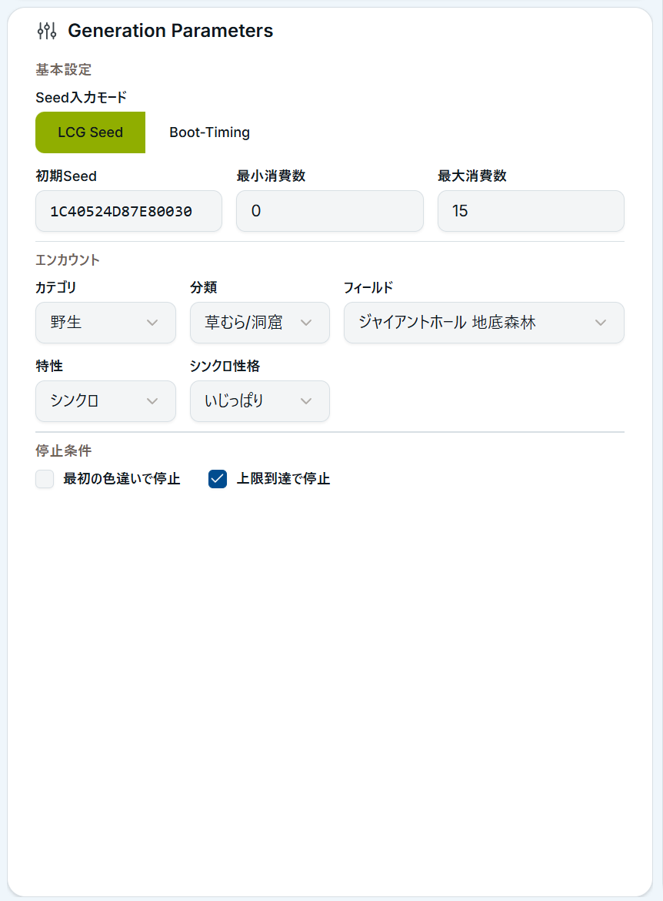
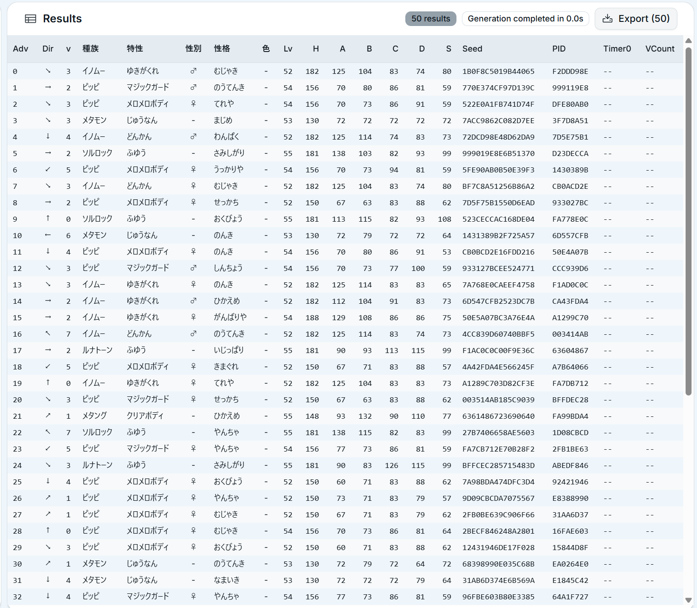

# BW 6Vメタモン乱数調整ガイド(pokemon-gen5-initseed版)

pokemon-gen5-initseedを使用して、ポケットモンスター ブラック・ホワイト（BW）で6Vメタモンを入手する手順を解説します。

---

## はじめに

### 本ガイドの対象

| 項目 | 内容 |
|------|------|
| 対象ソフト | ポケットモンスター ブラック / ホワイト |
| 対象ハード | ニンテンドーDS / DS Lite |
| 目標 | 6Vメタモンの入手 |

**対象外**: ブラック2・ホワイト2（BW2）、DSi / 3DS / 2DS
- 本ガイドはBW専用です。BW2以降のソフトではあまいかおりが使用できない等の制約により、手順が異なります。
- DSi / 3DS / 2DSは本ツール非対応です。

## 用語解説

| 用語 | 説明 |
|------|------|
| 初期Seed | ゲーム起動時に決定される乱数の種。起動日時・MACアドレス・キー入力・Timer0等から計算される |
| MT Seed | 個体値決定に使用される32bit値。初期Seedから導出される |
| Timer0 | DS本体の内部タイマー値。起動ごとに変動する可能性があり、「Timer0ズレ」の原因となる |
| VCount | 映像同期カウンタ。ROM・本体の組み合わせで範囲が決まる |
| 消費数 | 乱数を進める回数。レポート1回 = 消費1、ペラップのステータス確認 = 消費1 |

---

## 1. 事前準備

### 1.1 ハード・ソフト要件

- ニンテンドーDS または DS Lite
- ポケットモンスター ブラック または ホワイト
- (任意) よく出るTimer0を特定済みであること

### 1.2 ゲーム進行条件

- 殿堂入り済み
- ジャイアントホール 地底森林 に入れる状態

### 1.3 必要なポケモン・アイテム

| 種類 | 内容 |
|------|------|
| シンクロ要員 | 目的の性格で特性「シンクロ」を持つポケモン |
| あまいかおり要員 | 技「あまいかおり」を覚えたポケモン（トロピウス等） |
| 捕獲要員 | HPを削る技、状態異常技を覚えたポケモン(キノガッサ等) |
| ボール | クイックボール、タイマーボール、マスターボール等 |
| ペラップ（任意） | 技「おしゃべり」で音声を録音済みの個体(乱数消費用) |

### 1.4 ゲーム側での事前操作
必要なポケモン・アイテムを揃えたら、以下の準備を行います。
1. シンクロ要員をパーティの先頭に配置する
2. あまいかおり要員をパーティに加える
3. 捕獲要員をパーティに加える
4. ペラップ（任意）をパーティに加え、技「おしゃべり」の音声を録音する
5. ジャイアントホール 地底森林 (メタモンの出現マップ)に移動する
6. ジャイアントホールの霧を晴らす(1.5節参照)
7. くさむらに入った状態でセーブする(**注意**:濃い草むらではなく通常の草むらでセーブすること)

memo: 手持ちはペラップを含め5匹までに抑えることを推奨します。メタモン捕獲直後にステータス確認ができるため、乱数成否判定が容易になります。

### 1.5 ジャイアントホールの霧について

ジャイアントホールは常時霧が発生しており、通常は「あまいかおり」が使えません。
所定の手順で霧を晴らす必要があります。詳細は以下の記事を確認してください。

詳細: https://milk4724.hatenablog.com/entry/20220928/00000000

---

## 2. プロファイル設定（Profile）

本体とソフトの情報をツールに設定します。この設定はSearchパネル・Generationパネルで共通して使用されます。

### 2.1 ROM & HARDWARE

1. **Version**: 使用ROMに合わせる（`B` または `W`）
2. **Region**: 日本版なら `JPN`
3. **Hardware**: 使用本体（`DS` または `DS Lite`）
4. **MAC Address**: DS本体のMACアドレスを6セグメントで入力

:::info
タイトル後の選択画面にて「Wi-Fi設定」→「オプション」→「本体情報」の順番で進めるとMACアドレスが表示されます。
:::

### 2.2 Timer0 / VCount

Timer0とVCountの設定には2つの方法があります。Auto機能を使用すると便利です。

**Auto機能を使用する場合（推奨）**:
- 「Auto」スイッチをONにすると、ROM設定から標準値が自動設定されます。

**手動で指定する場合**:
- 「Auto」スイッチをOFFにして、特定の値を入力することもできます。出やすいTImer0・VCountが分かっている場合はこちらを使用するとよいでしょう。

### 2.4 GAME STATE

- **TID**: トレーナーID
- **SID**: 裏ID（色違い判定に使用。不明な場合は0で可）

---

## 3. 初期Seed/起動時間検索(Search)

プロファイル設定が完了したら、6Vメタモンが出る初期Seed・起動時間を検索します。

### 3.1 テンプレートからSeedを読み込む

本ツールにはテンプレート機能があり、6V用のSeed値を簡単に読み込めるようにしています。

1. 「**Search**」タブをクリックしてSearchパネルに移動
2. 「Target Seeds」カード内の「**Template**」ボタンをクリック
3. 「Seedテンプレートの選択」ダイアログが表示される
4. 「**BW 固定・野生 6V**」にチェックを入れる
5. 「**選択を適用**」ボタンをクリック

Seed入力欄に5件のSeedが読み込まれます。 `0x14B11BA6` 等のSeedが追加されていることを確認してください。

### 3.2 検索条件の設定(Search Parameters)

| 項目 | 設定値 | 備考 |
|------|--------|------|
| 開始日 | 検索開始年月日（例: `2000-01-01`） | `2000-01-01`推奨 |
| 終了日 | 検索終了年月日（例: `2099-12-31`） | `2099-12-31`推奨 |
| 時間範囲 | 時・分・秒の範囲を指定 | 秒の範囲を`11`～`11`などの固定範囲にすると後続手順がやりやすくなります |
| キー入力 | 白い画面中に押すキーを指定する | 時間範囲を狭めた場合設定することを推奨します |

#### キー入力について

「Configure」ボタンをクリックすると、使用するキーを選択するダイアログが表示されます。

一つのキーを有効化するごとに検索範囲と検索時間が約2倍になるため、必要最低限のキーに絞ることを推奨します。
- 例: 時間範囲を`11`～`11`に固定すると検索時間が1/60になる代わりに検索範囲も1/60となります。このような場合に、候補数を増やすために A, B, X, Y + 上下キーを指定することができます。

### 3.3 検索実行

1. 「Search Control」の「**Search**」ボタンをクリック
2. 検索が開始され、「Search Progress」に進捗が表示される
4. 検索完了後、「**Results**」に起動条件が表示される

:::tips
スマホを用いた長時間検索を行う場合は「**Keep Screen On**」をチェックすると画面がスリープしなくなります。

また、検索中に「**Cancel**」ボタンで中断可能です。
:::

#### Note:検索モードについて

- **CPU Parallel**: 通常の検索モード。マルチコア+SIMDによる検索を実行します。
- **GPU**: WebGPU検索モード。対応ブラウザの場合、より高速な検索が可能です。（推奨）

### 3.4 検索結果の確認

結果には以下の情報が含まれます:

| 項目 | 説明 |
|------|------|
| Seed | マッチしたMT Seed |
| 日時 | 起動時刻 |
| Timer0 | Timer0値 |
| VCount | VCount値 |
| キー入力 | 白い画面中に押すキー |

使いやすい日時・キー入力の条件を探して👁のアイコンをクリックすると詳細ダイアログが表示されます。

詳細ダイアログ内のLCG Seed をクリック・タップするとGenerationパネルに当該値がコピーされます。

---

## 4. 個体生成・検証（Generation）

見つかった起動時間でメタモンを出現させるための消費数を確認します。

### 4.1 Generationタブへ移動

画面上部のタブで「**Generation**」をクリックするとGenerationパネルに移動します。

### 4.2 Generation Parameters の設定

#### 基本設定

| 項目 | 設定値 |
|------|--------|
| Seed入力モード | 「**LCG Seed**」(メタモン検索時) /「**Boot-Timing**」を選択（timer0ずれ確認時） |
| Seed値 | 検索結果のSeedを入力（👁アイコンからコピー可能） |
| 起動日時 | 検索結果の日時を入力 （👁アイコンからコピー可能）|
| キー入力 | 検索結果のキー入力と一致させる （👁アイコンからコピー可能）|
| 最小消費数 | `0` |
| 最大消費数 | 必要に応じて設定（例: `50`） |

#### Seed入力モードについて

- **LCG Seed**: 64bitの初期Seedを直接入力する場合
- **Boot-Timing**: 起動日時・キー入力から計算する場合（検索結果を使用する際はこちらを利用してください）

### 4.3 エンカウント設定

| 項目 | 設定値 |
|------|--------|
| カテゴリ | `野生` |
| 分類 | `草むら/洞窟` |
| フィールド | `ジャイアントホール 地底森林` |
| 特性 | `シンクロ`（シンクロ要員使用時） |
| シンクロ性格 | 目的の性格（例: `いじっぱり`） |

### 4.4 生成実行と結果確認

1. 「**Generate**」ボタンをクリック
2. 「Results」に生成結果リストが表示される
3. 目的の種族・性格の行を探す
4. その行の「消費数」をメモする

#### 4.5 フィルタリングについて

「Filter」セクションで結果を絞り込むことができます。:
- **種族**: メタモン
- **性格**: 目的の性格
- **Timer0**: 特定のTimer0値に絞る場合(ずれ確認用)

---

## 5. 実機操作

### 5.1 DS時刻設定

1. DS本体の設定画面で日時を変更
2. 検索結果の日時に設定
   - 例: 結果が `2000/04/21 00:35:11` の場合、 日付を`2000/04/21`、時刻を`00:35` に設定

### 5.2 ソフト起動

1. DS本体メニューでBWを選択
2. **目標時刻の1秒前**（例: `00:35:10`）にソフトを選択

### 5.3 白い画面中の操作

ソフト選択後、約5秒間白い画面が表示されます。この間に**指定されたキーを押し続けてください**。

例: `A`, `B`, `→` の場合、3つのボタンを同時に長押しする(Nintendoロゴが表示されるまで押し続ける)

#### 注意事項
- キー入力の指定がない場合は**何も押さないでください**。
- 押し忘れがあると初期Seedが変わるため、必ず指定されたキーを押し続けてください。

### 5.4 ゲーム開始

1. メニュー画面で「つづきから はじめる」を選択
2. C-GEAR選択画面では、**「いいえ」を選択**

**注意**: C-GEARがオンになった場合、初期Seedが変わるため時刻設定からやり直してください。

### 5.5 乱数消費

フィールド画面が表示され、操作可能になったら目標の消費数だけ乱数を消費します。

主な乱数消費方法は以下の通りです:

| 方法 | 消費数 |
|------|--------|
| レポートを書く | 1 |
| ペラップのステータスを見る | 1 |

4.4でメモした消費数に達するまで乱数消費の操作を繰り返します。

例: メモした消費数が`25`の場合、レポートを25回書く、またはレポート5回+ペラップ20回等の組み合わせで達成可能です。

:::tips
レポートを書いて乱数を消費する場合、メッセージ右下の針(アイコン)の向きを複数回確認することを推奨します。
針の向きの並びとdir/v 列の並びを目視で比較することで現在の消費数/Timer0ずれの有無を確認可能です。

| 針の向き(dir) | 値(v) |
|------|----:|
| 上 | 0 |
| 右上 | 1 |
| 右 | 2 |
| 右下 | 3 |
| 下 | 4 |
| 左下 | 5 |
| 左 | 6 |
| 左上 | 7 |
:::

---

## 6. 捕獲と確認

### 6.1 エンカウント/捕獲
乱数消費が完了したら、あまいかおりを使用してメタモンを出現させ、捕獲します。

1. 「あまいかおり」を使用してエンカウント
2. メタモンが出現したら、捕獲要員でHPを削り状態異常にするなどして用意したボールで捕獲する
3. 捕獲したメタモンのステータスを確認する
   1. メニューから「ポケモン」を選択
   2. 捕獲したメタモンを選択
   3. メタモンの性格・ステータス(実数値)を確認する
4. 目的の性格・ステータスと一致していれば成功。異なる場合は手順5.1からやり直す

### 6.2 個体値確認(optional)

ステータス確認後、実際の個体値を確認するとより確実です。確認方法は以下の2つがあります:

1. ゲーム内ジャッジ機能
2. 個体値計算ツール: https://yakkun.com/dp/ic.htm

全能力が31（6V）であることを確認してください。

---

## 7. トラブルシューティング
- 狙った個体が出現しない場合、以下を確認してください
   - Timer0ズレ -> 複数回試行してみてください。
   - 時刻ズレ -> 起動タイミングを再確認してください。（ツールの出力時間の**1秒前**に起動していますか?） 
   - キー入力ミス -> 白い画面中のキー押し忘れがないか確認してください。
   - C-GEARオン -> 時刻設定からやり直してリトライしてください。
   - 消費数ミス -> レポート/ペラップ回数を確認してください。目標とした消費数の直前で針の向きで現在の消費数を特定するのも有効です。

- シンクロが機能しない場合、以下を確認してください
  - ツール側の**特性**欄が「シンクロ」になっているか確認してください。
  - シンクロ要員が先頭にいるか確認してください。
  - シンクロ要員の性格が目的の性格と一致しているか確認してください。
---

## 8. 参照資料
- 6Vメタモン乱数調整手順: https://milk4724.hatenablog.com/entry/20231230/00000000
- 霧の晴らし方について: https://milk4724.hatenablog.com/entry/20220928/00000000
- 個体値計算ツール: https://yakkun.com/dp/ic.htm

---

## チェックリスト
手順通りに実施できているかは以下のチェックリストで確認してください。

### ツール設定

- [ ] Profile: MACアドレスは正しいか
- [ ] Profile: ROMバージョン（Black/White）は合っているか
- [ ] Profile: ハードウェア（DS/DS Lite）は合っているか
- [ ] Search: テンプレート「BW 固定・野生 6V」を読み込んだか
- [ ] Generation: エンカウント設定は「ジャイアントホール 地底森林」か
- [ ] Generation: (特性を「シンクロ」に設定した場合)シンクロ性格はシンクロ要員の性格と一致しているか

### 実機操作

- [ ] DSの日付・時刻設定は秒単位まで正確か（ツールの出力する時刻の1秒前に起動したか）
- [ ] キー入力はロゴが消えるまで押し続けたか
- [ ] C-GEARはオフで開始したか
- [ ] 霧は晴れているか（ジャイアントホール）
- [ ] シンクロ要員は先頭に配置したか
- [ ] レポート時の針の向きでtimer0ずれ/消費数を確認したか
- [ ] 目的の消費数だけ乱数を進めたか

### 結果確認

- [ ] 捕獲したメタモンの性格は目的の性格か
- [ ] 捕獲したメタモンのステータスはツールの出力と一致しているか
- [ ] (ジャッジ機能/個体値計算ツールで確認)捕獲したメタモンの個体値は6Vか

---

## 更新履歴

| 日付 | 内容 |
|------|------|
| 2025-12-01 | 初版作成 |
